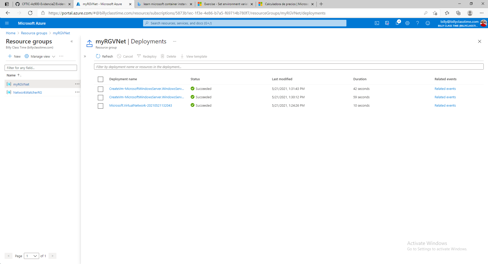

# 03 - Deploy Azure Container Instances

Resultado de la creación del Container Instance

Resultado de ejecutar el contenedor de instacia

Fin de la practica borrando el recurso

# 04 - Create a virtual network

